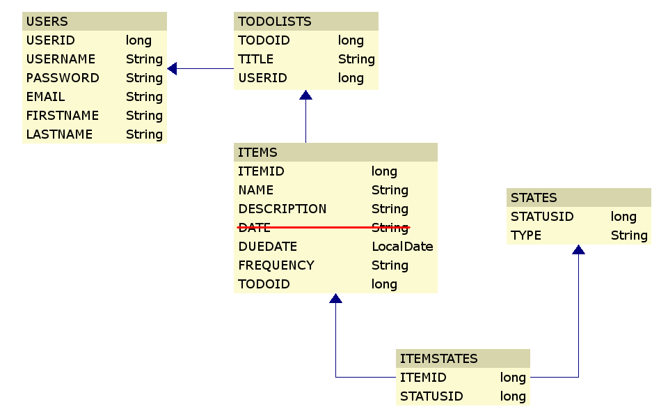

# backend
## Using Java & Spring Boot

Database concept model

## Users CRUD

Method | Endpoint | Description | Required Data
--- | --- | --- | ---
POST | /users/register | Creates a new user account | `username, password, email, firstname, lastname`
POST | /login | Logs in to account and fetches token | `username, password`
GET | /users/:userid | Returns an idividual User object 
PUT | /changeuser/:userid | Updates/Changes an entire User | `username, password, email, firstname, lastname`
PUT | /users/:userid | Changes a specific field in User object | Whichever single one of `username, password, email, firstname, or lastname` needed
DELETE | /users/:userid | Delete User based on userid

## Todo List CRUD
Method | Endpoint | Description | Required Data
--- | --- | --- | ---
POST | /todos/u/:userid/t/:title | Creates a new Todo List category for a specific User
GET | /todos | Returns all Todo Lists and their associated Items
GET | /todos/:todoid | Returns a specific Todo List by todoid and it's own associated Items
PUT | /todos/:todoid/t/:title | Updates/Changes the title of an existing Todo List
DELETE | /todos/:todoid | Deletes a Todo List and it's associated Items
## Items CRUD
Method | Endpoint | Description | Required Data
--- | --- | --- | ---
POST | /items/t/:todoid | Creates a new Item for a specific Todo List | `name, description, duedate, frequency`
GET | /items | Returns a list of all Items
GET | /items/:itemid | Returns information for a specific Item based on itemid
PUT | /changeitem/:itemid | Updates/changes an entire Item | `name, description, duedate, frequency, todolist (obj)`
PUT | /items/:itemid | Updates a single field in an existing Item | One of `name, description, duedate, frequency, todo (obj)`
DELETE | items/:itemid | Deletes an Item

## Status GETs
Method | Endpoint | Description | Required Data
--- | --- | --- | ---
GET | /status | Returns a list of all possible statuses
GET | /status/:statusid | Returns a specific Status